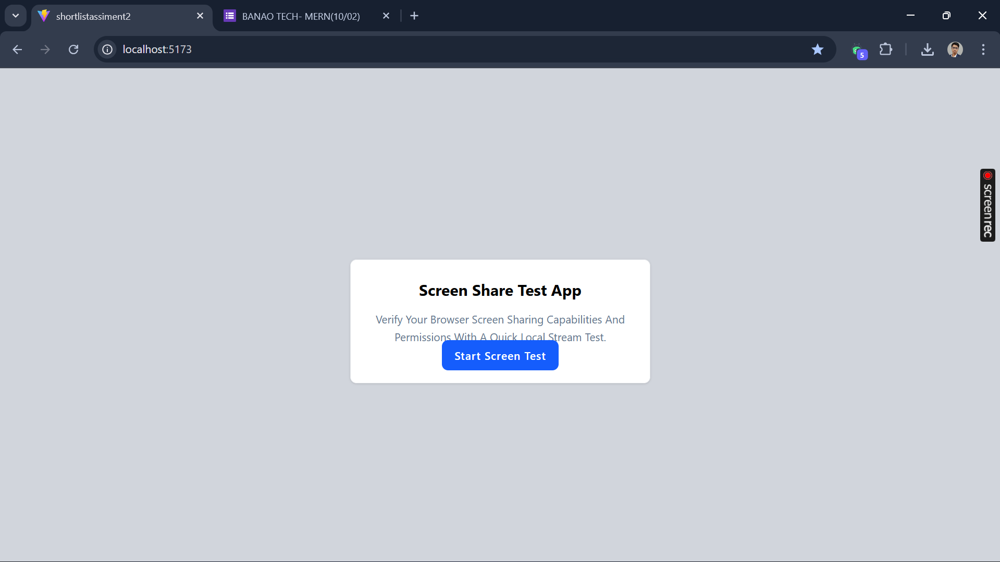
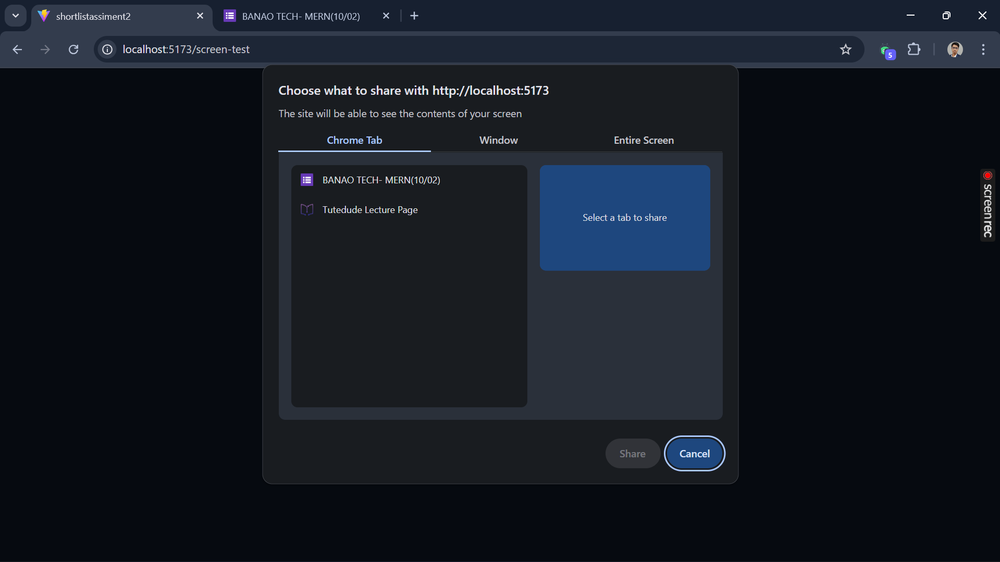
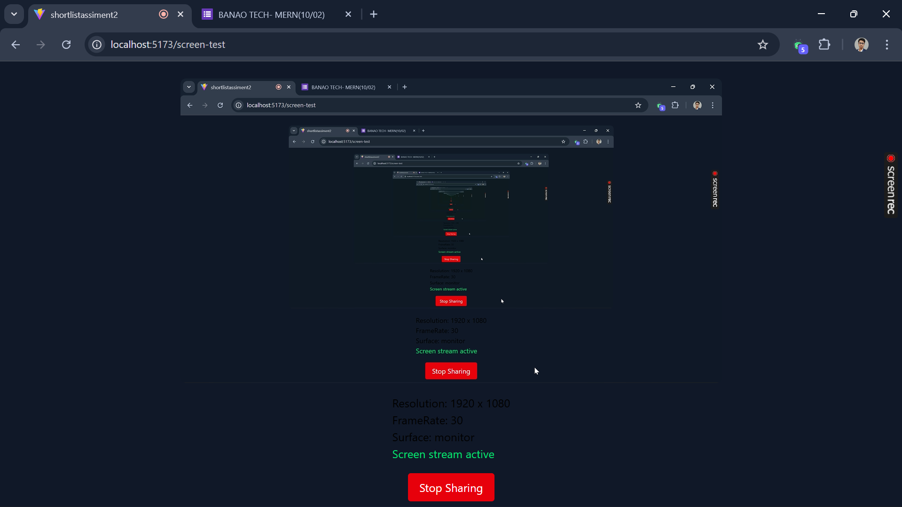
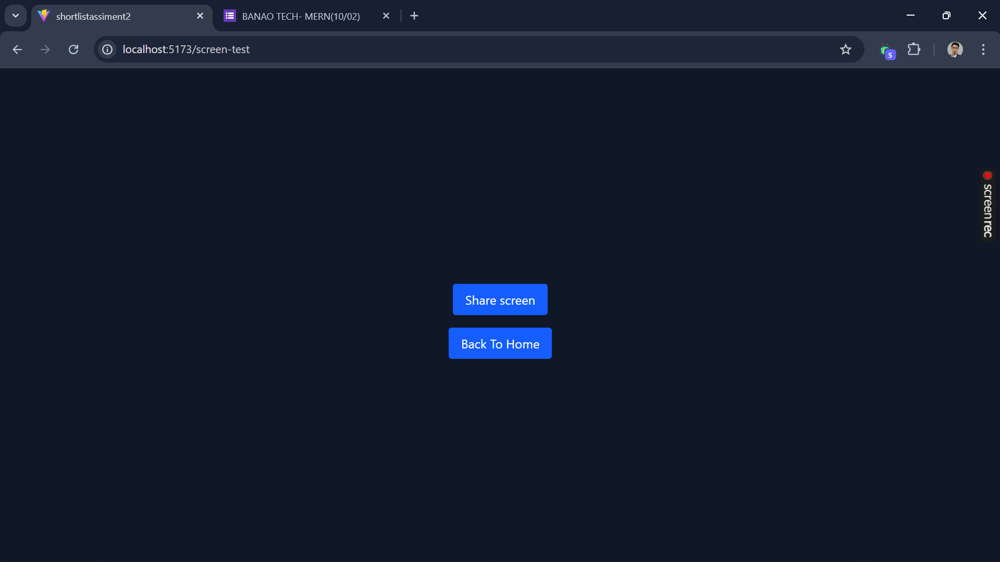

# Screen Share Test App

A frontend application that demonstrates browser screen-sharing using native Web APIs.  
The application focuses on permission handling, stream lifecycle management, clean React state handling, and proper resource cleanup.

---

##  Live Demo

https://your-live-link.vercel.app

---

## 🛠 Tech Stack

- React (Vite) / Next.js
- Tailwind CSS / Plain CSS
- Native Browser Web Media APIs
- Custom React Hooks

---

## ⚙ Setup Instructions

1. Clone the repository

git clone https://github.com/your-username/screen-share-test

2. Install dependencies

npm install

3. Start development server

npm run dev

4. Open in browser

http://localhost:5173 (Vite)  

---

##  Application Flow

### 1️ Capability Check

Before navigation, the application verifies:

navigator.mediaDevices.getDisplayMedia

If unsupported, a proper browser unsupported message is shown.

---

### 2 Permission Request

On clicking "Start Screen Test", the app calls:

navigator.mediaDevices.getDisplayMedia({
  video: { frameRate: { ideal: 30 } },
  audio: false
})

Distinct states are handled:

- Requesting permission
- Permission granted
- User cancelled screen picker
- Permission denied
- Unknown error

Each state updates the UI explicitly.

---

### 3️ Live Screen Preview

After permission is granted:

- A live preview is displayed inside a `<video>` element.
- Metadata is extracted using:

track.getSettings()

Displayed information:
- Resolution (width × height)
- Frame rate
- Display surface type (tab/window/screen if available)
- Stream active status

---

### 4️ Stream Lifecycle Handling

The app listens to:

track.onended

This detects:

- Manual stop from browser UI
- Unexpected browser stream termination

When detected:
- UI updates immediately
- All media tracks are stopped
- Video element srcObject is cleared
- State resets properly

---

### 5️ Retry Flow

After screen sharing stops:

- Retry starts a fresh getDisplayMedia request
- Old streams are never reused
- All previous tracks are stopped
- No memory leaks occur

---

##  Architecture

- Screen sharing logic is isolated inside a custom hook: `useScreenShare`
- UI components remain stateless
- Reusable Button component implemented
- Proper cleanup on component unmount using:

useEffect(() => {
  return () => cleanup()
}, [])

---

## 🌐 Browser Support

Tested on:

- Google Chrome
- Microsoft Edge

Note:
- Requires HTTPS or localhost
- Mobile browsers may not support screen sharing
- Some browsers may not expose display surface metadata

---

## ⚠ Known Limitations

- Screen sharing works only in secure contexts (HTTPS or localhost)
- Audio sharing is disabled in this implementation
- Mobile browsers typically do not support getDisplayMedia
- Display surface type may vary across browsers

---

## 📸 Screenshots

### Homepage

### Permission Request State

### Active Screen Preview

### Stopped State

